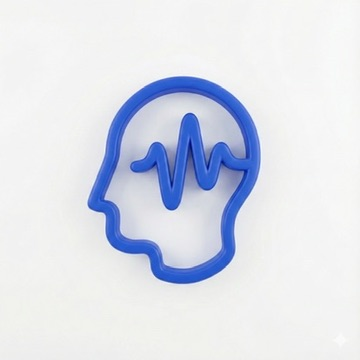

<h1 style="margin:0;font-size:22px;color:#1e40af">Propuesta Comercial</h1>

NeuraOrkesta | Gestor Inmobiliario

**Fecha:** Abril 2026 &nbsp;|&nbsp; **Preparado por:** NeuraCall &nbsp;|&nbsp; **Para:** [Nombre del cliente]

---

## La Plataforma

**NeuraOrkesta** es un sistema de gestión integral para administraciones inmobiliarias. Todo en un solo lugar, accesible desde cualquier dispositivo, sin instalar nada.

Se compone de tres pilares:

NEURA CORE

Tu operación diaria: propiedades, contratos, liquidaciones, facturación y tesorería

NEURA SYNC

Conexiones automáticas: AFIP, conciliación bancaria, índices de alquiler, cotización del dólar

NEURA INSIGHT

Visibilidad total: tableros, mapa de propiedades, alertas y búsqueda inteligente

---

## Qué Incluye

### NEURA CORE — Operación & Gestión

| Módulo | Qué resuelve |
|---|---|
| **Propiedades** | Cargás todos tus inmuebles con dirección, tipo, superficie, ambientes, precio y estado (disponible o alquilada). Filtros y búsqueda rápida |
| **Contratos** | Creás contratos paso a paso: elegís propiedad, inquilino, propietario, condiciones (monto, moneda, índice de ajuste, depósito, comisión). Adjuntás documentos y queda el historial completo |
| **Actualización por índices** | Los alquileres se ajustan automáticamente según ICL o IPC. El sistema te avisa cuando toca ajustar, te propone el monto nuevo y vos confirmás |
| **Clientes y Proveedores** | Base de datos de propietarios, inquilinos y proveedores de mantenimiento con datos fiscales y de contacto |
| **Órdenes de trabajo** | Registrás reclamos o reparaciones, los asignás a un proveedor, seguís el estado hasta que se complete y facture. Se deduce automáticamente de la liquidación del propietario |
| **Cuentas corrientes** | Historial de movimientos por cada cliente con saldo acumulado |
| **Expensas y Servicios** | Cargás expensas y servicios (luz, gas, agua, internet) por propiedad y período. Controlás qué está pago y qué está pendiente |
| **Liquidaciones** | Liquidás al propietario con las deducciones que correspondan (comisión, impuestos, reparaciones). El sistema calcula el neto automáticamente |
| **Facturación** | Emitís facturas completas: elegís cliente, tipo de comprobante, cargás los ítems con IVA, y listo. Soporta pesos y dólares |
| **Tesorería** | Registrás ingresos y egresos, manejás cuentas bancarias y de efectivo, emitís órdenes de pago a proveedores |

### NEURA SYNC — Conexiones Automáticas

| Conexión | Qué hace |
|---|---|
| **Conciliación AFIP** | Cruza tus comprobantes contra lo que figura en AFIP. Te muestra qué coincide, qué tiene diferencias y qué falta cargar |
| **Conciliación bancaria** | Importás el extracto del banco (CSV) y el sistema clasifica automáticamente cada movimiento. Lo que no puede resolver te lo marca para revisar |
| **Índices de alquiler** | Se conecta al Banco Central (ICL) y al INDEC (IPC) para traer los índices actualizados y aplicarlos a los contratos |
| **Cotización del dólar** | Muestra en tiempo real el dólar oficial, blue, MEP y CCL. Se usa automáticamente cuando facturás en dólares |

### NEURA INSIGHT — Visibilidad y Control

| Herramienta | Qué te da |
|---|---|
| **Tablero principal** | Pantalla de inicio con los números más importantes del día: cobros, pagos, pendientes, dólar |
| **Mapa de propiedades** | Todas tus propiedades ubicadas en el mapa, con datos al hacer click |
| **Alertas** | Te avisa: contratos por vencer, ajustes de alquiler pendientes, servicios vencidos, reclamos urgentes |
| **Búsqueda global** | Buscás cualquier cosa (propiedad, contrato, cliente, factura) desde cualquier pantalla |

---

## Plataforma

- 100% en la nube, accesible desde computadora, tablet o celular
- Múltiples usuarios con permisos por área
- Logo y colores de tu empresa
- Modo claro y oscuro
- Exportación a PDF y Excel
- Datos protegidos con respaldo automático diario

---

## Inversión

### Setup Inicial (única vez)

Incluye: configuración completa, migración de datos existentes, capacitación del equipo, alta de usuarios.

USD 10.000

### Suscripción Mensual

Todo incluido: NEURA CORE + NEURA SYNC + NEURA INSIGHT + hosting + soporte + mantenimiento. Hasta 5 usuarios.

ARS 200.000 + IVA /mes

### Sin cargo adicional

| Incluido | |
|---|---|
| Módulo CRM (contactos y seguimiento de interesados) | Bonificado |

### Ampliaciones

Funcionalidades adicionales, integraciones con otros sistemas y módulos nuevos se cotizan por separado según necesidad.

---

## Condiciones

- **Setup:** 50% al inicio, 50% contra entrega
- **Mensual:** Transferencia bancaria al inicio del mes
- **Contrato mínimo:** 6 meses, luego renovación automática
- **Soporte:** Lunes a viernes de 9 a 22hs (email y chat)
- **Manual de usuario:** Incluido, con guías paso a paso de cada módulo
- **Cancelación:** Con 30 días de preaviso
- **Tus datos son tuyos:** exportables en cualquier momento
- **Implementación:** 4 a 6 semanas por etapas (relevamiento → configuración → capacitación → marcha blanca → go-live)

---

NeuraCall

NeuraOrkesta — Plataforma de Gestión Empresarial

